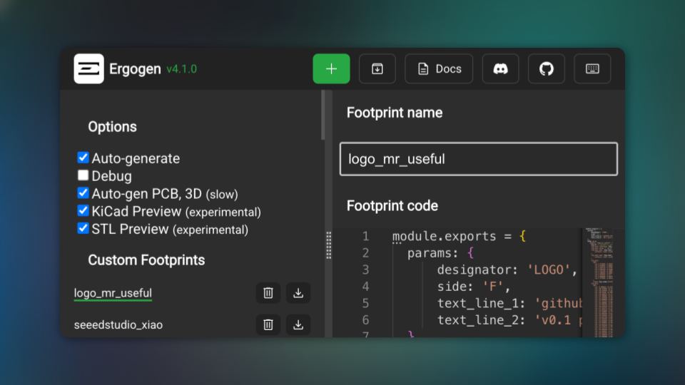

# Changelog

## Load Keyboards Directly from GitHub

_October 13, 2025_

Ever wanted to share your keyboard design with a friend or try out someone else's layout? You can now load complete keyboard configurations directly from GitHub, including all the custom footprints!

Previously, loading a configuration from GitHub only brought in the basic layout file. You'd have to manually recreate any custom components (like special switches or connectors) that the design depended on. This was time-consuming and error-prone, often leading to confusing errors about missing parts.

Now, when you load a keyboard from GitHub, the app automatically discovers and loads all custom footprints from the repository – even those stored in separate libraries using Git submodules. If you already have a footprint with the same name, you'll get a friendly dialog asking whether to skip, overwrite, or keep both versions.

The app also got smarter about finding configurations. It can now search through entire repositories to locate the right files, and it'll warn you if you're running low on your hourly request allowance so you know to take a break before trying again.

**What changed:**

- **Automatic footprint loading**: Custom components are now loaded alongside configurations from GitHub repositories
- **Smart conflict resolution**: Interactive dialog lets you choose how to handle duplicate footprint names
- **Git submodule support**: Loads footprints from external libraries referenced in the repository
- **Intelligent file discovery**: Searches entire repositories to find configuration files in any location
- **Usage monitoring**: Proactive warnings when approaching GitHub's request limits, with clear guidance
- **Better feedback**: Loading progress bar now appears when fetching from GitHub
